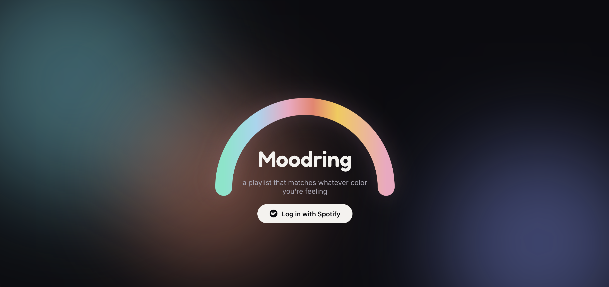
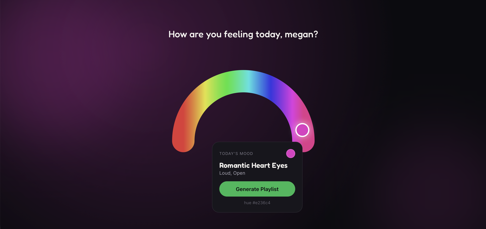
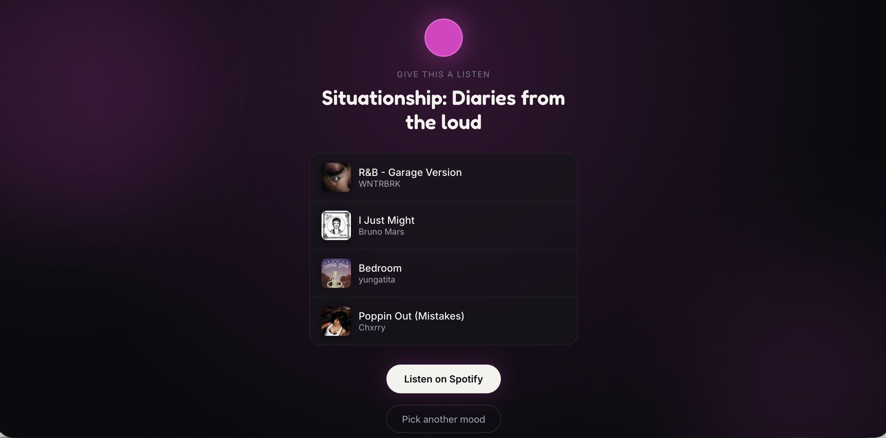

# Moodring

Moodring is a web application that creates personalized Spotify playlists based on your mood. Users select a color from an interactive color wheel, and Moodring interprets that color to generate a playlist with matching genres, energy, and atmosphere.

**Live Demo:** https://yourusername.github.io/moodring/

## Features

- Spotify authentication
- Interactive color-based mood selection
- Dynamic playlist generation
- Randomized playlist titles
- Responsive design

## Built With

- React
- Vite
- JavaScript
- Spotify Web API
- GitHub Pages

## Preview

### Landing Page

### Mood Selection

### Generated Playlist

## Inspiration

Moodring was inspired by the idea that colors can represent emotions. Instead of asking users to choose from predefined moods, the app lets them express how they're feeling through color and translates that into a personalized Spotify playlist.